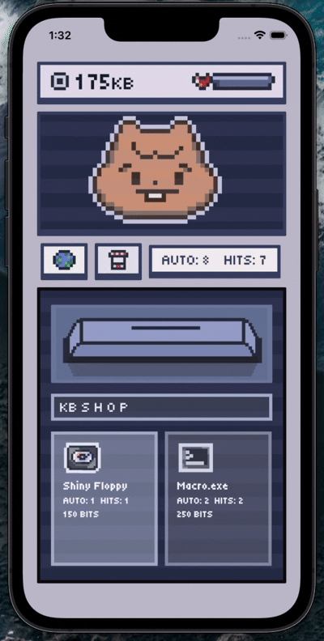

# 📱 ARLO.EXE Clicker

A simple retro clicker game for Android. 


## description

INTRO: 
My first ever coding project!! 
I'm sorry if there are flaws in the GitHub or the app itself. 
I used Flutter to create a simple clicker game with nice art, sounds, and logic. 
I lwk didn't spend much time on the lore, but you're running a program called ARLO.EXE, which generates bits the more time you spend clicking away at it! ( Arlo is the quokka )

HOW THE GAME WORKS: 
Your computer starts with 0 KB, and as you click, you can spend your bits to upgrade your computer to gain more bits. As you progress, you go from kb -> mb -> gb -> tb 
Your computer also has a health bar, which slowly depletes. When it's at zero, your bits per second go back to zero, and you have to spend bits to repair your computer. 
Try to get as many bits as possible! Have fun <: 

AI USE & OTHER INFO:
I tried to use as little AI as possible for the code; all art is by me. 
A little AI was used to do simple debugging for the progression system.  
I used AI to help me make the shared preferences (data saving), sound system, and animation drawing part inside Flutter, which I had no experience with. 
I also used AI to organize the provider/model class b/c it was really messy, but everything in there I did myself, except for the things listed above. 

---

## demo




## game features

- fun idle clicker
- local data saving
- satisfying sounds
- responsive clicks and taps
- chill music
- auto click system
- progression system
- computer health and repairing mechanics
- shop upgrades and money system
- stats

  
## ui features
- retro-themed UI
- cool colors
- w art by me
- animations

---

## screenshots

| Home | Profile | Settings |
|------|----------|-----------|
|  |  |  |

---

# install it!!

## With Code editor 

First, get these installed: 

- Flutter SDK
- Dart SDK
- VS Code or Android Studio
- emulator or Android device

Run to check the installation: 

```bash
flutter doctor
```

clone the repo:

```bash
git clone https://github.com/AsherTsai/ARLO.EXE-Clicker.git
```

Go into the project folder:

```bash
cd ARLO.EXE-Clicker
```

install dependencies:

```bash
flutter pub get
```

Run the app:

```bash
flutter run
```

## With APK File

1. Go to project releases
2. Download APK for Android
3. Install and enjoy!!

---

Music inside the game: 
Song: Zachz, Фрози, Joyful - Boogie
Music provided by NoCopyrightSounds
Free Download/Stream: http://ncs.io/Boogie
Watch: http://ncs.lnk.to/BoogieAT/youtube


## made with

- Flutter
- Dart
- Provider 


made by Asher Tsai
